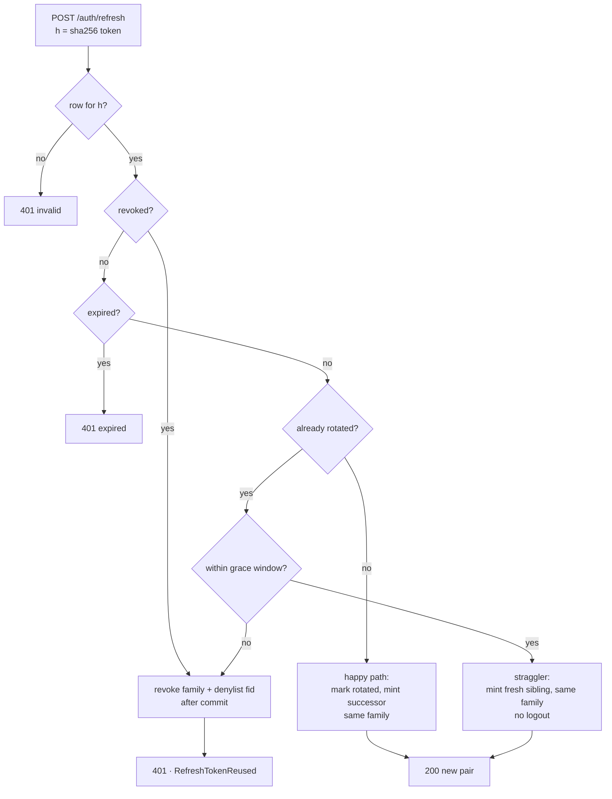

# Architecture & Security

This page explains *why* Lukk is built the way it is, maps its behavior to the relevant standards, and gives a checklist you can audit against. For day-to-day usage see the other pages; this is the reference for reviewers and the security-minded.

- [Why a Custom Package](#why-a-custom-package)
- [Layered Design](#layered-design)
- [The Refresh Algorithm](#the-refresh-algorithm)
- [Reuse Detection](#reuse-detection)
- [Database Schema](#database-schema)
- [Standards Mapping](#standards-mapping)
- [Security Checklist](#security-checklist)
- [Upgrading to RS256](#upgrading-to-rs256)
- [References](#references)

<a name="why-a-custom-package"></a>
## Why a Custom Package

Lukk deliberately does not use Passport, `league/oauth2-server`, or `tymon/jwt-auth`. OAuth's authorization-code / PKCE / confidential-client machinery exists to delegate access to **third parties** — client IDs, redirect URIs, an authorization server. A **first-party** application, where you own both the client and the API, has no third party to delegate to, so all of that is ceremony with no payoff.

Lukk replaces it with a direct credential login that mints its own tokens, and keeps only the OAuth-world patterns that genuinely carry weight: **short-lived access JWTs, opaque rotating refresh tokens, reuse detection, and a denylist.**

The one firm rule: the JWS layer is delegated to the audited `firebase/php-jwt`. Hand-rolling JWT encode/verify is exactly where `alg=none`, RS256→HS256 confusion, and non-constant-time comparisons creep in. Lukk's code touches **lifecycle and policy**, never the crypto primitives.

<a name="layered-design"></a>
## Layered Design

The architecture mirrors Sanctum:

| Layer | Responsibility |
|---|---|
| **Controllers** | Thin — run an Action, return a Response contract. |
| **Actions** | Single-purpose orchestration; the policy lives here. |
| **Contracts** | The swap seams — issuer, verifier, repository, denylist, responses. |
| **Concrete implementations** | The defaults bound to each contract. |

This separation is what makes Lukk customizable without edits (see [Customization](customization.md)). Critically, the rotation **policy** (in `Actions\RotateRefreshToken`) is separate from token **storage** (behind `Contracts\RefreshTokenRepository`), so you can swap the database for Redis without touching the security-critical logic.

<a name="the-refresh-algorithm"></a>
## The Refresh Algorithm

Refresh is atomic and reuse-detecting. In pseudocode:

```
POST /auth/refresh (opaque refresh token RT):
  h = sha256(RT)
  in a transaction:
    row = SELECT ... WHERE token_hash = h FOR UPDATE
    if no row              -> 401 invalid
    if row.revoked_at      -> revoke family; 401   (a killed token was replayed)
    if row.expires_at past -> 401 expired
    if row.rotated_at:
        if within grace    -> mint a fresh successor sibling, same family (a straggler; no logout)
        else               -> revoke family; 401   (post-grace replay = theft)
    # happy path:
    mark row rotated; insert successor in the same family
  mint a new access token
  return { access, refresh, expires_in }
```



The family is revoked **after** the transaction commits, never inside it — revoking inside the transaction and then throwing would roll back the revocation while the denylist cache write persisted, leaving an inconsistent state.

<a name="reuse-detection"></a>
## Reuse Detection

Rotation alone isn't enough; reuse detection is what makes it worth doing. Every refresh token belongs to a **family** (`family_id`) that is stable across a rotation chain. When a token that has already been consumed (or already revoked) is presented after the grace window, that's the signature of a stolen token being replayed — so Lukk revokes the **entire family** and denylists it by `fid`, killing every live access token for that session within one `access_ttl`. It also dispatches [`RefreshTokenReused`](events.md#refreshtokenreused) so you can alert on it.

The **grace window** (`grace_seconds`) is the counterweight that prevents false positives: legitimate concurrent refreshes (multiple tabs, SSR + hydration) present the same token nearly simultaneously, and within the window the older one is served a fresh access token under the same family rather than being treated as theft.

> [!NOTE]
> **Accepted residual.** The grace window is a deliberate trade-off: a token *stolen and replayed within `grace_seconds` of a legitimate refresh* yields a fresh successor on a sibling chain instead of a family revoke — so that race produces a parallel session reuse-detection won't catch until the thief replays a *consumed* token past grace. This is the price of never falsely logging out a direct (non-BFF) client that can't be single-flighted; keep `grace_seconds` as small as your concurrency tolerates. Watch [`RefreshTokenReused`](events.md#refreshtokenreused) for the post-grace replays that *are* caught. Relatedly, a single-use 2FA/step-up *challenge* token fired in two truly-simultaneous requests can mint two token pairs **for the same user** before the single-use marker lands — a same-subject race, not a privilege escalation.

<a name="database-schema"></a>
## Database Schema

```php
Schema::create('refresh_tokens', function (Blueprint $table) {
    $table->ulid('id')->primary();
    $table->foreignId('user_id')->index();
    $table->uuid('family_id')->index();          // stable across a rotation chain
    $table->char('token_hash', 64)->unique();    // sha256(opaque token)
    $table->ulid('previous_id')->nullable();     // audit chain
    $table->timestamp('rotated_at')->nullable(); // set when consumed
    $table->timestamp('revoked_at')->nullable(); // hard kill (logout / reuse cascade)
    $table->timestamp('expires_at')->index();
    $table->timestamps();
});
```

The denylist is held in the **cache, not a table** — it is keyed by `jti` and `fid`, and each entry self-evicts when the token it revokes would have expired anyway. That makes revocation O(revoked sessions) rather than O(all tokens).

<a name="standards-mapping"></a>
## Standards Mapping

| Requirement | Standard |
|---|---|
| Pin the algorithm on decode; reject `alg=none` and mismatches | RFC 8725 |
| Validate `iss`/`aud`/`exp` (required) + `nbf`/`iat` when present; carry `jti` | RFC 7519, 8725 |
| `typ=at+jwt` header | RFC 9068 |
| Access TTL ≤ 15 min | RFC 9700 |
| Refresh-token rotation | OAuth 2.1 §6 |
| Reuse detection → family revoke | RFC 9700 §4.14 |
| Concurrency without false logout (grace window) | fosite / Okta reuse interval |
| Refresh opaque + `sha256` at rest; never logged | RFC 9700 / OWASP |
| Instant revocation (denylist by `fid`/`jti`) | OWASP Session Management |
| Login throttled + constant-time (no user enumeration) | OWASP ASVS |
| Tokens kept out of the browser; sealed `__Host-` cookie | OAuth 2.0 for Browser-Based Apps |
| Token responses non-cacheable (`Cache-Control: no-store`) | RFC 6749 §5.1 |
| Reuse/family-revoke emits a security event | RFC 9700 §4.14.2 |

<a name="security-checklist"></a>
## Security Checklist

- [x] Decode always passes an explicit algorithm; `alg=none` and mismatches rejected.
- [x] `iss`/`aud`/`exp`/`nbf` validated on every request; `aud` bound to the API.
- [x] Access TTL ≤ 15 min; header `typ=at+jwt` stamped **and asserted** — a 2FA/step-up challenge token (same key/iss/aud) is rejected as a bearer.
- [x] Refresh tokens opaque, `sha256` at rest, never logged, never JS-readable.
- [x] Invalid/expired/revoked/reused refresh tokens return `401`, not 500, without leaking the reason.
- [x] Rotation on; post-grace replay revokes the whole family.
- [x] Grace window prevents false logout under concurrency.
- [x] Denylist (`fid`/`jti`) kills access within one request; global logout (`DELETE /sessions`) works.
- [x] Login throttled; password check constant-time; unknown user indistinguishable from wrong password.
- [x] HS256 secret ≥ 256-bit random (`php artisan lukk:secret`); v7 enforces the minimum.
- [x] Token responses carry `Cache-Control: no-store`.
- [x] Reuse/family-revoke dispatches `Events\RefreshTokenReused`.
- [x] Expired/not-yet-valid tokens, and tokens whose `sub` user was deleted, rejected at the guard.
- [x] **(2FA)** Challenge single-use + short TTL; TOTP single-use within its window; account-throttled; recovery codes salted+hashed and single-use; secret encrypted; enroll→confirm before activation; step-up to manage; `amr` reflects `otp`.
- [x] **(Passkeys)** Challenge server-generated, single-use, origin/RP-ID bound; assertion checks UP/UV + signature + pinned algorithms; sign-count regression rejected but `0` never flagged; credential IDs globally unique; public key encrypted at rest; `amr` reflects `webauthn`.

<a name="upgrading-to-rs256"></a>
## Upgrading to RS256

HS256 (a shared secret) is correct *because* this application is its own sole verifier — there is no keypair to distribute and no JWKS to publish. The day an independent service must verify your tokens without holding the signing secret, switch to RS256 (or ES256). The default issuer/verifier already support it, so it is configuration, not a rewrite:

1. **Generate a keypair** — `php artisan lukk:keygen` (or `--algorithm=ES256`). It prints the PEMs and the env to set.
2. **Point the issuer at it** — set `LUKK_ALGORITHM=RS256`, `LUKK_ACTIVE_KID`, `LUKK_PRIVATE_KEY`, and `LUKK_PUBLIC_KEY` (see [Configuration → Asymmetric keys](configuration.md#asymmetric-keys-rs256--es256)).
3. **Give verifiers only the public key** — the auth service exposes `GET /auth/jwks` (a cacheable JWK Set, public keys only). A separate **lukk** verify-only service is configured with the public key directly in its `keys.public` (lukk reads keys from config — it does not fetch a remote JWKS); a non-lukk consumer (an API gateway, another framework) can fetch the JWKS instead. Either way the private key never leaves the issuer.

Two properties make this safe to operate:

- **Algorithm pinning.** The verifier pins the algorithm from config onto every key and never reads it from the token header — so an attacker cannot present an HS256 token signed with the public key as the HMAC secret (the classic RS256→HS256 confusion). `alg=none` is likewise rejected.
- **Key rotation without forced logout.** Keys are addressed by `kid`. To rotate, generate a new key, add it to the `public` map, point `active` at it, and keep the retired public key listed until its last token expires — old tokens keep verifying through the overlap, new tokens are signed by the new key.

Because the swap lives entirely behind `Contracts\TokenIssuer` and `Contracts\TokenVerifier`, the rotation policy, guard, and HTTP layer are untouched. Until you actually need an independent verifier, the extra moving parts of asymmetric keys buy nothing — stay on HS256.

<a name="references"></a>
## References

**IETF RFCs**

- [RFC 7519 — JWT](https://www.rfc-editor.org/rfc/rfc7519)
- [RFC 7515 — JWS](https://www.rfc-editor.org/rfc/rfc7515)
- [RFC 7517 — JWK / JWKS](https://www.rfc-editor.org/rfc/rfc7517)
- [RFC 7518 — JWA](https://www.rfc-editor.org/rfc/rfc7518)
- [RFC 6749 — OAuth 2.0](https://www.rfc-editor.org/rfc/rfc6749) · [RFC 6750 — Bearer Token Usage](https://www.rfc-editor.org/rfc/rfc6750)
- [RFC 8725 — JWT Best Current Practices](https://www.rfc-editor.org/rfc/rfc8725)
- [RFC 9068 — JWT Profile for OAuth Access Tokens (`at+jwt`)](https://www.rfc-editor.org/rfc/rfc9068)
- [RFC 9700 — OAuth 2.0 Security BCP](https://www.rfc-editor.org/rfc/rfc9700)
- [OAuth 2.1 (draft)](https://datatracker.ietf.org/doc/draft-ietf-oauth-v2-1/) · [OAuth 2.0 for Browser-Based Apps (draft)](https://datatracker.ietf.org/doc/draft-ietf-oauth-browser-based-apps/)

**OWASP**

- [Application Security Verification Standard (ASVS)](https://owasp.org/www-project-application-security-verification-standard/)
- [JWT Cheat Sheet](https://cheatsheetseries.owasp.org/cheatsheets/JSON_Web_Token_for_Java_Cheat_Sheet.html) · [Session Management Cheat Sheet](https://cheatsheetseries.owasp.org/cheatsheets/Session_Management_Cheat_Sheet.html)

**Two-factor & passkeys**

- [RFC 6238 — TOTP](https://www.rfc-editor.org/rfc/rfc6238) · [RFC 4226 — HOTP](https://www.rfc-editor.org/rfc/rfc4226) · [RFC 8176 — Authentication Method Reference (`amr`)](https://www.rfc-editor.org/rfc/rfc8176)
- [W3C WebAuthn Level 2](https://www.w3.org/TR/webauthn-2/) · [NIST SP 800-63B](https://pages.nist.gov/800-63-3/sp800-63b.html)

**Libraries**

- [`firebase/php-jwt`](https://github.com/firebase/php-jwt) · [`pragmarx/google2fa`](https://github.com/antonioribeiro/google2fa) · [`web-auth/webauthn-lib`](https://github.com/web-auth/webauthn-framework)
