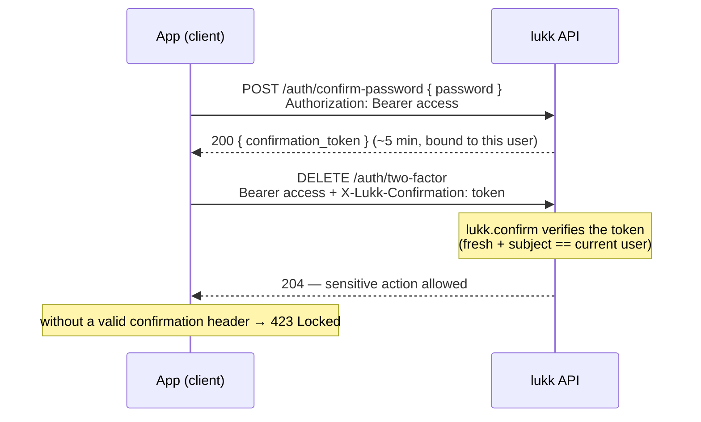

# Confirmation (Sudo Mode)

Some actions are sensitive enough that a valid session isn't sufficient — you want proof that the *person* is still there. Lukk provides **step-up confirmation**: a short-lived "sudo" window, modeled on GitHub's, that the user enters by re-confirming a credential. Sensitive routes then require that proof.

- [How It Works](#how-it-works)
- [Earning Confirmation](#earning-confirmation)
- [Gating Your Own Routes](#gating-your-own-routes)
- [Configuration](#configuration)

<a name="how-it-works"></a>
## How It Works

1. The user re-confirms with a **password** or a **passkey** and receives a short-lived `confirmation_token`.
2. The client sends that token in a request header (default `X-Lukk-Confirmation`) on subsequent sensitive requests.
3. The `lukk.confirm` middleware checks for a valid, fresh token. If it is missing or expired, the route returns **423 Locked**.

The window length is `confirm.ttl` (default 5 minutes). Lukk's own [two-factor](two-factor-authentication.md) and [passkey](passkeys.md) management routes are protected this way.



<a name="earning-confirmation"></a>
## Earning Confirmation

### With a Password

```http
POST /auth/confirm-password
Authorization: Bearer <access token>
Content-Type: application/json

{ "password": "secret" }
```

```json
{ "confirmation_token": "..." }
```

### With a Passkey

If [passkeys](passkeys.md) are enabled, a passkey assertion earns the same token, so passkey-only users can step up too:

```http
POST /auth/confirm-passkey
Authorization: Bearer <access token>
```

Both endpoints return the same kind of `confirmation_token` — the credential used is interchangeable.

<a name="gating-your-own-routes"></a>
## Gating Your Own Routes

Apply the `lukk.confirm` middleware to any route that should require a fresh confirmation — account deletion, an email change, revealing an API key, and so on:

```php
Route::delete('/account', [AccountController::class, 'destroy'])
    ->middleware(['auth:api', 'lukk.confirm']);
```

The client then attaches the confirmation token to the request:

```http
DELETE /account
Authorization: Bearer <access token>
X-Lukk-Confirmation: <confirmation token>
```

A request that reaches a gated route without a valid, fresh token receives `423 Locked`. Your front-end should respond to a `423` by prompting the user to re-confirm, then retrying.

<a name="configuration"></a>
## Configuration

```php
// config/lukk.php
'confirm' => [
    'ttl' => (int) env('LUKK_CONFIRM_TTL', 300),
    'header' => env('LUKK_CONFIRM_HEADER', 'X-Lukk-Confirmation'),
],
```

| Key | Default | Description |
|---|---|---|
| `ttl` | `300` (5 min) | How long a confirmation token remains valid. |
| `header` | `X-Lukk-Confirmation` | The header the middleware reads the token from. |
