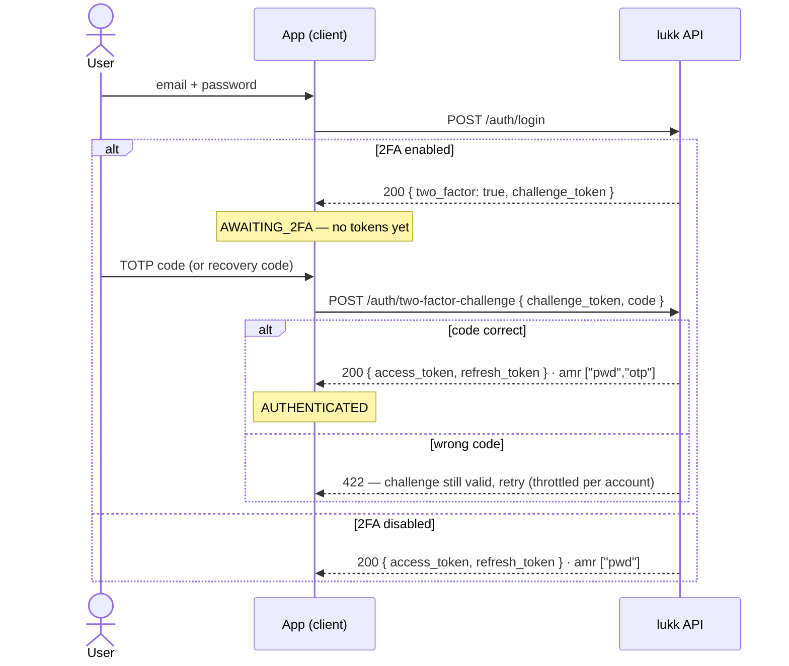
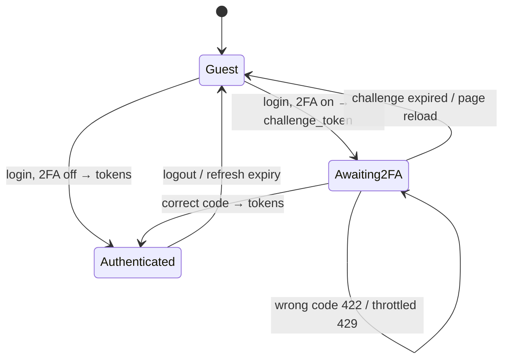

# Two-Factor Authentication

Lukk ships optional, opt-in two-factor authentication (2FA) using time-based one-time passwords (TOTP) — the codes generated by apps like Google Authenticator and 1Password — with single-use recovery codes as a backup.

> [!NOTE]
> On the client, the [lukk-js 2FA composables](https://stsepelin.github.io/lukk-js/two-factor-authentication) drive the challenge, enrolment, and recovery-code flows described here.

- [Setup](#setup)
- [How It Works](#how-it-works)
- [Endpoints](#endpoints)
- [Enrolling a User](#enrolling-a-user)
- [Logging In With 2FA](#logging-in-with-2fa)
- [Recovery Codes](#recovery-codes)
- [Security Notes](#security-notes)

<a name="setup"></a>
## Setup

Install the TOTP library, publish and run the migration (it adds columns to your `users` table), and enable the feature:

```bash
composer require pragmarx/google2fa
php artisan vendor:publish --tag=lukk-two-factor-migrations
php artisan migrate
```

```php
// config/lukk.php
'features' => [
    'two_factor' => true,
    // ...
],
```

Add the `HasTwoFactorAuthentication` trait to your `User` model:

```php
use Lukk\Concerns\HasRefreshTokens;
use Lukk\Concerns\HasTwoFactorAuthentication;

class User extends Authenticatable
{
    use HasRefreshTokens;
    use HasTwoFactorAuthentication;
}
```

The trait manages the `two_factor_secret`, `two_factor_recovery_codes`, and `two_factor_confirmed_at` columns. See [Configuration → Two-Factor](configuration.md#two-factor) for the available options.

<a name="how-it-works"></a>
## How It Works

2FA uses a two-step enrolment and a two-step login:

- **Enrolment** is `enable` → `confirm`. Enabling provisions a secret and returns the `otpauth://` URI and recovery codes; the user must submit a valid code to `confirm` before 2FA actually activates. This prevents locking a user out with a secret they never successfully scanned.
- **Login** is `login` → `two-factor-challenge`. When a user with confirmed 2FA logs in, the login endpoint returns a short-lived **challenge token** instead of tokens; the client exchanges it, plus a code, for the real token pair.

<a name="endpoints"></a>
## Endpoints

These routes are registered only when `features.two_factor` is enabled.

| Method | Path | Middleware | Purpose |
|---|---|---|---|
| `POST` | `/auth/two-factor` | `auth` + confirm | Begin enrolment → `{ otpauth_uri, recovery_codes }` (shown once). |
| `POST` | `/auth/two-factor/confirm` | `auth` + confirm | Activate 2FA after a valid `code`. |
| `GET` | `/auth/two-factor/recovery-codes` | `auth` | How many recovery codes remain (a count — never the codes). |
| `POST` | `/auth/two-factor/recovery-codes` | `auth` + confirm | Regenerate recovery codes. |
| `DELETE` | `/auth/two-factor` | `auth` + confirm | Disable 2FA. |
| `POST` | `/auth/two-factor-challenge` | `throttle` | Exchange a `challenge_token` + `code`/`recovery_code` for a token pair. |

> [!NOTE]
> The management routes (everything except the challenge) are gated by [step-up confirmation](confirmation.md) — the user must have recently re-confirmed their identity. Changing someone's 2FA settings should require fresh proof.

<a name="enrolling-a-user"></a>
## Enrolling a User

1. The user posts to `/auth/two-factor`. The response contains the provisioning URI (render it as a QR code) and the recovery codes (display them once):

   ```json
   {
       "otpauth_uri": "otpauth://totp/Example:taylor@example.com?secret=...",
       "recovery_codes": ["aaaa-bbbb", "cccc-dddd", "..."]
   }
   ```

2. The user scans the QR code with their authenticator app and submits a generated code to `/auth/two-factor/confirm`. 2FA is now active.

<a name="logging-in-with-2fa"></a>
## Logging In With 2FA

When a 2FA-enabled user logs in, `/auth/login` returns a challenge rather than tokens:

```json
{ "two_factor": true, "challenge_token": "..." }
```

The client submits the challenge with a TOTP `code` (or a `recovery_code`) to `/auth/two-factor-challenge`:

```http
POST /auth/two-factor-challenge
Content-Type: application/json

{ "challenge_token": "...", "code": "123456" }
```

This returns the normal [token pair](authentication.md#logging-in), carrying the claim `amr: ["pwd","otp"]` to record that two factors were used. The challenge is single-use and short-lived; a wrong code leaves it usable so the user can retry, and the endpoint is throttled per account.



The client's own state — note that **`AWAITING_2FA` holds only the short-lived `challenge_token` and has no access token**, so protected routes stay blocked until the exchange succeeds:



<a name="recovery-codes"></a>
## Recovery Codes

Recovery codes let a user authenticate if they lose their device. Each code works **once**. Submit one as `recovery_code` (instead of `code`) to `/auth/two-factor-challenge`. Users can regenerate the full set at any time via `/auth/two-factor/recovery-codes`, which invalidates the old codes.

<a name="security-notes"></a>
## Security Notes

- The TOTP secret is stored **encrypted** (it must be reversible to verify codes), while recovery codes are **salted and hashed** and shown only once.
- A TOTP code cannot be replayed within its 30-second window — accepted codes are cached and rejected on reuse.
- The verification window is ±1 step and should not be widened (see [Configuration](configuration.md#two-factor)).

> [!WARNING]
> TOTP is **not phishing-resistant**. A real-time attacker-in-the-middle (such as Evilginx) can relay a code and steal the session. For phishing-resistant authentication, use [passkeys](passkeys.md).
